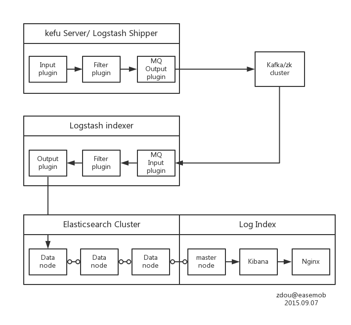

# 使用ELK分析JAVA错误日志

## 需求

分析JAVA的错误日志，按照关键字过滤，把符合的日志收集并展示。

日志内容示例
```
[ERROR][2015-09-07 00:01:11,751] com.easemob.weichat.service.IMChannelServiceImpl - jid=easemob-demo#jianguo1_1437026992conn@easemob.com login failed with 2968 times.
org.jivesoftware.smack.sasl.SASLErrorException: SASLError using PLAIN: not-authorized
        at org.jivesoftware.smack.SASLAuthentication.authenticate(SASLAuthentication.java:348) ~[kefu-connector-1.2.0.FINAL.jar:na]
        at org.jivesoftware.smack.tcp.XMPPTCPConnection.login(XMPPTCPConnection.java:244) ~[kefu-connector-1.2.0.FINAL.jar:na]
        at com.easemob.weichat.service.IMChannelServiceImpl.getXMPPConnectionAndLogin(IMChannelServiceImpl.java:312) [kefu-connector-1.2.0.FINAL.jar:na]
        at com.easemob.weichat.service.IMChannelServiceImpl.startChannel(IMChannelServiceImpl.java:249) [kefu-connector-1.2.0.FINAL.jar:na]
        at com.easemob.weichat.service.IMChannelServiceImpl.startChannel(IMChannelServiceImpl.java:89) [kefu-connector-1.2.0.FINAL.jar:na]
        at com.easemob.weichat.techchannel.easemob.IMChannelService$Processor$startChannel.getResult(IMChannelService.java:467) [kefu-connector-1.2.0.FINAL.jar:na]
        at com.easemob.weichat.techchannel.easemob.IMChannelService$Processor$startChannel.getResult(IMChannelService.java:452) [kefu-connector-1.2.0.FINAL.jar:na]
        at org.apache.thrift.ProcessFunction.process(ProcessFunction.java:39) [kefu-connector-1.2.0.FINAL.jar:na]
        at org.apache.thrift.TBaseProcessor.process(TBaseProcessor.java:39) [kefu-connector-1.2.0.FINAL.jar:na]
        at org.apache.thrift.server.AbstractNonblockingServer$FrameBuffer.invoke(AbstractNonblockingServer.java:518) [kefu-connector-1.2.0.FINAL.jar:na]
        at org.apache.thrift.server.Invocation.run(Invocation.java:18) [kefu-connector-1.2/data/apps/log/kefu/connector-error.log
```


## ELK简介

* Elasticsearch

  Elasticsearch是一种可高扩展的开源的全文搜索分析引擎，可以近实时的快速保存，查询和分析大
  容量的数据。

* Logstash

* Kibana

## 平台架构

### 日志分析平台组成

* Logstash Shipper: 配置Logstash input plugin读取日志文件， Filter plugin处理日志,
MQ output plugin把日志写入Kafka集群

* Kafka Cluster: 作为消息队列，保存处理过的日志，作为Logstash Indxer的消息源。

* Logstash Indxer: 配置Logstash MQ input plugin从Kafka Cluster里读取新的日志，
Filter plugin处理日志，Output plugin把日志写入Elasticsearch Cluster。

* Elasticsearch Cluster: 日志数据库。

* Log Index: Kibana从Elasticsearch Cluster读取日志并做数据可视化，Nginx配置安全访问。



### 服务器列表

Kafka Cluster
```
ops-ali-hangzhou-zk1
ops-ali-hangzhou-zk2
ops-ali-hangzhou-zk2
ops-ali-hangzhou-kafka1
ops-ali-hangzhou-kafka2
ops-ali-hangzhou-kafka3
```
Elasticsearch Cluster
```
ops-ali-hangzhou-ela1
ops-ali-hangzhou-ela2
ops-ali-hangzhou-ela3
ops-ali-hangzhou-logindex
```
Logstash Indexer
```
ops-ali-hangzhou-logindex
```

## 服务配置

### Logstash Shipper

Logstash shipper和indexer只是配置不同的logstash服务，shipper负责从日志源中读取新的日志，
进行处理然后存入消息队列中。

在客服服务器上安装logstash
```
# yum install logstash -y
# rpm -qa | grep logstash
logstash-1.5.2-1.noarch
```
配置客服connector错误日志shipper

file: /etc/logstash/patterns/kefu.grok
```
JAVATIME %{YEAR}-%{MONTHNUM}-%{MONTHDAY}%{SPACE}%{TIME}
KEFUERROR \[%{NOTSPACE:loglevel}\]\[%{JAVATIME:logtime}\] %{GREEDYDATA:logmessage}
```
kefu.grok按照日志内容定义了grok样式，把日志从普通文本格式转换成JSON格式，这里会把一条日志转换成三个字段，
"loglevel", "logtime", "logmessage"。

file: /etc/logstash/conf.d/connector-error-shipper.conf
```
input {
  file {
    path => [ "/data/apps/log/kefu/connector-error.log" ]
    tags => [ "kefu-conn-error" ]
  }
}
filter {
  if "kefu-conn-error" in [tags] {
    multiline {
      pattern => "^\["
      negate  => true
      what    => "previous"
    }
    grok {
      patterns_dir => [ "/etc/logstash/patterns/" ]
      match => { "message" => "%{KEFUERROR}" }
      add_field => {
         "hostname"=> "kf10"
         "project"=> "kefu"
      }
      add_tag => [ "kefu_error_groked" ]
    }
    date {
      match => [ "logtime", "yyyy-MM-dd HH:mm:ss,SSS" ]
      target => "@timestamp"
    }
    if [message] =~ /java.util.ConcurrentModificationException/ {
      mutate {
        add_tag => "kefu-alert"
        add_field => { "error_type" => "java.util.ConcurrentModificationException" }
      }
    }
    if [message] =~ /java.net.ConnectException/ {
      mutate {
        add_tag => "kefu-alert"
        add_field => { "error_type" => "java.net.ConnectException" }
      }
    }
    if [message] =~ /java.lang.NullPointerException/ {
      mutate {
        add_tag => "kefu-alert"
        add_field => { "error_type" => "java.lang.NullPointerException" }
      }
    }
    if [message] =~ /MySQLIntegrityConstraintViolationException/ {
      mutate {
        add_tag => "kefu-alert"
        add_field => { "error_type" => "MySQLIntegrityConstraintViolationException" }
      }
    }
    if [message] =~ /java.sql.SQLException/ {
      mutate {
        add_tag => "kefu-alert"
        add_field => { "error_type" => "java.sql.SQLException" }
      }
    }
    if [message] =~ /Response REST API receive onFailure/ {
      mutate {
        add_tag => "kefu-alert"
        add_field => { "error_type" => "ResponseRESTAPIreceiveonFailure" }
      }
    }
    if "kefu-alert" not in [tags] {
      drop { }
    }
    mutate {
      remove_field => [ "message" ]
    }
  }
}
output {
  stdout{
  }
  if "kefu-alert" in [tags] {
    kafka {
      broker_list => "kafka1:9092"
      topic_id => "kefu_webapp_error"
    }
  }
}
```
connector-error-shipper.conf文件里使用了三种类型的plugin, input, filter和output。
* input plugin
  * file: 从文件/data/apps/log/kefu/connector-error.log读取日志，增加tag "kefu-conn-error"。
* filter plugin
  * multiline: 用于处理多行日志，把多行的内容合并为一条消息。
  * grok: 根据定义样式把匹配的日志从文本格式转换成JSON格式，增加"hostname"和"project"字段，增加tag "kefu_error_groked"。
  * date: 匹配日志中的日期格式，把日期转成"@timestamp"字段，存入Elasticsearch Cluster时这个字段是日志展示的时间点。
  * mutate: 对使用正则匹配过关键字的日志，加上tag "kefu-alert"和字段"error_type"。
  * drop: 丢弃不带"kefu-alert" tag的日志。
  * mutate: 移除日志中的"message"的字段，"message"字段是日志的原始文本，日志内容已经在字段"logmessage"里，所以可以移除，减少传输开销。
* output plugin
  * stdout: 把日志写到标准输出，如果logstash服务是以service运行的，日志写入/var/log/logstash/logstash.stdout。
  * kafka: 把带有"kefu-alert" tag的日志写入"ops-ali-hangzhou-kafka1:9092"的topic "kefu_webapp_error"。

### Logstash Indexer

在logindex服务器上安装logstash
```
# yum install logstash -y
# rpm -qa | grep logstash
logstash-1.5.2-1.noarch
```
配置Logstash Indexer

file: /etc/logstash/conf.d/logstash-indexer.conf
```
input {
  kafka {
    zk_connect => "zk1:2181"
    topic_id => "kefu_webapp_error"
    tags => "kefu_webapp_error"
  }
}
output {
  if "kefu_webapp_error" in [tags] {
    stdout { }
    elasticsearch {
      index => "kefu_webapp_error-%{+YYYY.MM.dd}"
      host => ["ela-data1:9200", "ela-data2:9200", "ela-data3:9200"]
      protocol => "http"
    }
  }
}
```
logstash-indexer.conf文件里使用了两种类型的plugin, input和output。
* input plugin
  * kafka: 指定zookeeper的连接字符串"ops-ali-hangzhou-zk1:2181"和Kafka topic "kefu_webapp_error"，增加tag "kefu_webapp_error"
* output plugin
  * stdout: 把日志写到标准输出，如果logstash服务是以service运行的，日志写入/var/log/logstash/logstash.stdout。
  * elasticsearch: 把带有"kefu_webapp_error" tag的日志写入"ops-ali-hangzhou-logindex:9200"的index "kefu_webapp_error-%{+YYYY.MM.dd}"，以http的协议连接elasticsearch。

### Elasticsearch Cluster

Elasticsearch可以配置两种角色，data节点和master节点，这两种角色的区别可以简单的理解为，
data节点保存数据，master节点不保存数据。master节点可以实现elasticsearch集群的读写分
离。

在架构图里，我们配置了四个节点，三个data节点和一个master节点。master节点是运行在logindex
服务器上作为读数据接口，三个数据节点配置SLB，SLB的地址作为写数据接口。SLB非必须，也可以把
三个data节点的列表作为写数据接口。

配置数据节点/etc/elasticsearch/elasticsearch.yml, 配置节点2和3时，修改node.name。
```
cluster.name: OPS_HZ_LOG_Cluster
node.name: ela-data1
node.master: true
node.data: true
path.conf: /etc/elasticsearch/
path.data: /data/elasticsearch/data
path.work: /data/elasticsearch/tmp
path.logs: /data/elasticsearch/logs

bootstrap.mlockall: true
index.cache.field.max_size: 500000
index.cache.field.expire: 5m
discovery.zen.fd.ping_timeout: 60s
discovery.zen.fd.ping_retries: 10
discovery.zen.fd.ping_interval: 5s

discovery.zen.ping.unicast.hosts: [ "ela-data1:9300", "ela-data2:9300", "ela-data3:9300" ]

http.enabled: true
http.jsonp.enable: true
```
配置master节点，/etc/elasticsearch/elasticsearch.yml
```
cluster.name: OPS_HZ_LOG_Cluster
node.name: ops-ali-hangzhou-logindex
node.master: true
node.data: false
path.conf: /etc/elasticsearch/
path.data: /data/elasticsearch/data
path.work: /data/elasticsearch/tmp
path.logs: /data/elasticsearch/logs

bootstrap.mlockall: true
index.cache.field.max_size: 500000
index.cache.field.expire: 5m
discovery.zen.fd.ping_timeout: 60s
discovery.zen.fd.ping_retries: 10
discovery.zen.fd.ping_interval: 5s

discovery.zen.ping.unicast.hosts: [ "ela-data1:9300", "ela-data2:9300", "ela-data3:9300", "logindex:9300" ]

http.enabled: True
http.jsonp.enable: True
```
配置文件修改后，重启服务
```
# service elasticsearch restart
```

查看集群状态
```
# curl localhost:9200/_cluster/health?pretty
{
  "cluster_name" : "OPS_HZ_LOG_Cluster",
  "status" : "green",
  "timed_out" : false,
  "number_of_nodes" : 4,
  "number_of_data_nodes" : 3,
  "active_primary_shards" : 431,
  "active_shards" : 862,
  "relocating_shards" : 0,
  "initializing_shards" : 0,
  "unassigned_shards" : 0,
  "delayed_unassigned_shards" : 0,
  "number_of_pending_tasks" : 0,
  "number_of_in_flight_fetch" : 0
}

# curl localhost:9200/_cat/nodes?pretty
logindex 10.252.251.166 14 46 1.52 - m ops-ali-hangzhou-logindex
ela-data3     10.252.120.77  23 72 0.00 d m ela-data3
ela-data2     10.252.112.227 28 73 0.00 d * ela-data2
ela-data1     10.252.117.74  20 73 0.00 d m ela-data1
```

### Kibana
把kibana-4.1.1下载解压到/data/kibana，配置service启动脚本/etc/init.d/kibana
```
#!/bin/sh
#
# kibana -- startup script for kibana4
#
# chkconfig: - 85 15
# processname: kibana
# pidfile: /var/run/kibana.pid
# description: Kibana is a webui to visualize data
#
### BEGIN INIT INFO
# Provides: kibana
# Required-Start: $local_fs $remote_fs $network
# Required-Stop: $local_fs $remote_fs $network
# Default-Start: 2 3 4 5
# Default-Stop: 0 1 6
# Short-Description: start and stop kibana
### END INIT INFO
#
#
. /etc/init.d/functions

PIDFILE="/var/run/kibana.pid"
KIBANA_DIR="/data/kibana/"

start() {
        echo -n "Starting Kibana Daemon: "
        if [ -f $PIDFILE ]; then
                PID=`cat $PIDFILE`
                echo Kibana already running: $PID
                exit 1;
        else
                cd $KIBANA_DIR
                PID=`./bin/kibana >/dev/null 2>&1 & echo $! > $PIDFILE`
                echo `cat $PIDFILE`
        fi

}

stop() {
        echo -n "Shutting down Kibana Daemon: "
        echo
        killproc kibana
        echo
        rm -f /var/lock/subsys/kibana
        return 0
}

case "$1" in
    start)
        start
        ;;
    stop)
        stop
        ;;
    status)
        status kibana
        ;;
    restart)
        stop
        start
        ;;
    *)
        echo "Usage:  {start|stop|status|restart}"
        exit 1
        ;;
esac
exit $?
```
启动服务, 查看端口5601是否在侦听
```
# service kibana start
# netstat -lnt | grep 5601
```
配置Nginx，使用账户密码访问kibana。配置文件/etc/nginx/conf.d/kibana.conf
```
#
# HTTPS server configuration
#

upstream kibana
{
    server 127.0.0.1:5601 max_fails=50 weight=3;
}

server {
    listen       80;
    listen       443;
    server_name  _;

    ssl                  on;
    ssl_certificate      /etc/nginx/https/server.crt;
    ssl_certificate_key  /etc/nginx/https/server.key;

    ssl_session_timeout  5m;

    ssl_protocols  SSLv2 SSLv3 TLSv1;
    ssl_ciphers  ALL:!ADH:!EXPORT56:RC4+RSA:+HIGH:+MEDIUM:+LOW:+SSLv2:+EXP;
    ssl_prefer_server_ciphers   on;

    location / {
        auth_basic "Password Required";
        auth_basic_user_file /etc/nginx/htpasswd/easemob.pwd;
        proxy_pass http://kibana;
    }
}
```
制作htpasswd密码文件
```
# yum install httpd-tools
# htpasswd -bc easemob.pwd username password
# mv easemob.pwd /etc/nginx/htpasswd/
```
启动Nginx
```
# service nginx restart
```
